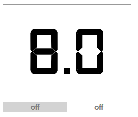

# domaso-raspberry
Raspberry Pi project to remotely control a holiday home, intially the Italian Perry heating system

- Spring boot web server with embedded Tomcat
- REST web service interface, with web service security
- Raspberry PI control of heating system via temperature sensor + relay to turn heating system on or off
- ReactJS thin client UI
- Docker file ( web server runs under Docker on the PI )

